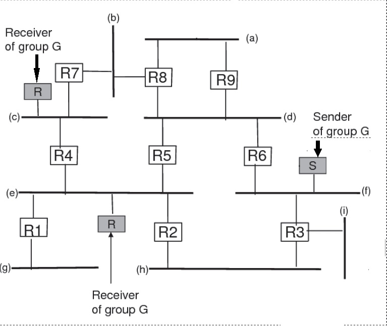
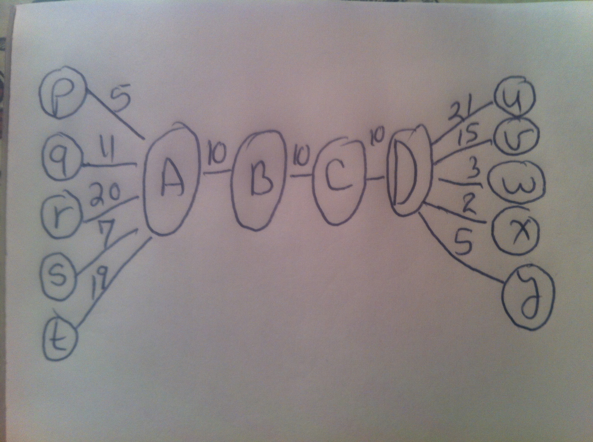

# HW II CS 6390 Summer 2017

All questions count equally

## Question 1 (MOSPF)
<!--================-->

Consider the figure attached to the homework. For MOSPF, show me the cache
entry that each router would build after the source begins to send multicast
messages to the group. The metric is minimum hop, and you break ties by lower
router number (e.g. R3 and R6, break ties in favor of R3). 

## Question 2 (PIM)
<!--=============-->

Consider PIM, and assume we do the following modification. When a router has
joined the shortest-path tree to the source, it does not prune itself from the
shared tree (RPT). Assume that the same forwarding rules apply: if you receive
a mcast message from your parent on the SPT, you forward it to your children on
both trees, the SPT and the RPT. If you receive it from the parent on the RPT,
you forward it only to children on the RPT.

Show me a scenario in which mcast packets may loop around forever (if we ignore
the time to live field, of course)

## Question 3 (PIM Inter-domain)
<!--=======================-->

Assume that we are doing inter-domain PIM using MSDP, and we modify PIM as
follows. When the RP at a domain A becomes aware of a source in a domain B,
then the RP of A joins the tree of the RP of B (instead of the tree of the
source). Will this work in general? If yes argue why, if not show me a scenario
where the system will have incorrect behavior.

## Question 4 (OLSR)
<!--==========--> 

1. Prove that the flooding mechanism of OLSR works correctly. I.e., if there
   are two nodes x and y in the network, and if there is a path of
   bidirectional links between x and y, then a flood originating at x will
   reach y. Obviously you need to provide a proof by induction on the length of
   the path between x and y.

2. In the TC message of OLSR that is created by each node x, x includes its MS
   set, i.e., a list of nodes that have selected it as an MPR. Assume instead
   that TC messages created by each node x, let x include its MPR set (rather
   than its MS set). Will the routing still work properly?

## Question 5 (DSR)
<!--=============-->

In the DSR protocol, I wrote the following: (The source) "Piggybacks Route
Error on new Route Request to clear intermediate nodes’ route caches,
preventing the return of an invalid route" Show me a scenario where this is
necessary. I.e., if the source did not piggy-back the router error message on
the new route request message an invalid route is received by the source in the
route reply.

## Question 6: Virtual Circuits
<!--====================-->

1. Consider a link A --> B along the path from a source S to a destination D.
   Why is B (and not A) the one choosing the virtual circuit ID of the data
   from S to D? 

2. Why is it possible to have very small virtual circuit IDs? (e.g. two bytes
   long) 

3. Consider the attached figure. There is a virtual circuit from p to u,
   another from q to v, from r to 2, from s to x, and from t to y. The virtual
   circuit numbers are indicated in the links. Along the path A - B - C - D, B
   and C are not aware of the individual circuits, and a single virtual circuit
   ID is used.  Only A and D are aware of the individual circuits. (i) How
   would you accomplish this? (ii) Show me the virtual circuit tables of A and
   D.

## Question 7: MPLS
<!--==============-->

Assume you have a large network of nodes joined with point to point links.
Assume that a node A has several neighbors, e.g., W, X, Y, and Z. Routing is
done using OSPF.

Assume A wants to enhance fault tolerance by using MPLS to bypass any of its
neighboring links if the link fails.

Describe how A would compute and setup the MPLS path(s) to accomplish fault
tolerance.

## Question 8: Fair Queuing  
<!--===================-->

1. Consider two packets, p1 and p2, (perhaps of different flows, perhaps of the
   same flow). Assume that F(p1) < F(p2). I.e., the label given to p1 is less
   than that of p2. Argue that these labels do not need to be modified once
   they are assigned. I.e., they do not need to change regardless of the
   arrival of new flows or the termination of existing flows. 

2. Consider an interval of time, [t1, t2], and assume that the number of flows
   that are backlogged (still having bits in the queue) of the fake server
   remain constant during the interval. Let V(t1) = X, i.e., the virtual time
   (or round number) at time t1 is X. Argue that

    V(t2) = X + (t2-t1)*C/B

    where C is the capacity of the output channel and B is the number of
    backlogged flows during the interval [t1, t2].

