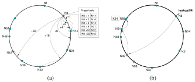

# Peer-to-peer Lookup Service for Internet Applications

Motivation: How to find data in a distributed file sharing system?

- Centralized: Napster
    + Simple centralized scheme
    + Use a centralized index database. Servers contact the index node to
      upload their list of content at initialization
    + To locate a file
        1. Send a query to central index node
        1. Get the list of peer locations storing the file
    + Fetch the file directly from one of the peers.

- Flooding(Distributed): Gnutella
    + Find a node to get onto the system
    + To find a file
        1. Broadcast request to all neighbors
        1. On receiving a request, if don’t have the file  Re-broadcast to
           other neighbors
        1. If have the file, pass the info to the requester
    + Advantages: Totally decentralized, highly robust.
    + Disadvantages: Not scalable.

- Partial Flooding(Distributed): FastTrack (aka Kazaa)
    + Modifies the Gnutella protocol into two-level hierarchy (Hybrid of
      Gnutella and Napster)
    + Supernodes
        * Nodes that have better connection to Internet
        * Act as temporary indexing servers for other nodes
        * Help improve the stability of the network
    + Standard nodes
        * Connect to supernodes and report list of files
        * Allows slower nodes to participate
    + Use broadcast (Gnutella-style) search across supernodes.
    + Initially, you register with a centralized server.  You then connect to a
      supernode from there.

# Chord

At its heart, Chord provides fast distributed computation of a hash function
mapping keys to nodes responsible for them. Chord assigns keys to nodes with
consistent hashing.

## Consistent Hashing and Lookup

The consistent hash function assigns each node and key an m bit identifier
using SHA-1 as a base hash function. A node’s identifier is chosen by hashing
the node’s IP address, while a key identifier is produced by hashing the key.

A key is stored at its successor: node with next higher (or equal) ID.

Lookups could be implemented in some different way:

- Fast Search, but Big Routing Tables

  Every node knows all other nodes (requires global information. Routing tables
  are large, adding a node is slow (need to update all the nodes in the
  system). But loopup are constant time (O(1)).

- Small Routing Tables, but Slow Search

  Each node need only know how to contact its current successor node on the
  identifier circle. Queries for a given identifier could be passed around the
  circle via these successor pointers until they encounter a pair of nodes that
  straddle the desired identifier; the second in the pair is the node the query
  maps to.

- Scalable Lookups

  As before, let  be the number of
  bits in the key/node identifiers. Each node
   maintains a routing table with up
  to  entries, called the finger
  table.

  The _i_-th entry in the table at node
   contains the identity of the first
  node s that succeeds  by at least
   on the identifier circle,
  i.e.,
  ),
  where  (and all
  arithmetic is modulo  ). We call
  node  the _i_-th finger of node
  , and denote it by
  .

  A finger table entry includes both the Chord identifier and the IP address
  (and port number) of the relevant node. Note that the first finger of
   is the immediate successor of
   on the circle; for convenience we
  often refer to the first finger as the __successor__.

A lookup example is shown below.

> Lookup(15): table says: 12 .. 14 stored in N14, 16 .. 21 stored in N21, so
> __don’t overshoot__, and forward to N14.

__Only the successor__ of each node is assumed to be correct.

You can only __overshoot__ if the key is between yourself and your successor.

### Comments on Lookup

Two important characteristics of finger tables

- Each node stores info about only a small number of others.

- A node does not generally have enough info to directly determine the
  successor of an arbitrary key k.

With high probability, take O(logN) N = number of nodes ___on ring___

True lookup upper bound:

- If tables are not accurate, N

- Assume tables are accurate, M (M bit)

### Join the Ring

Three steps in general:

1. Initialize all fingers of new node.

   Locate any node on the ring, ask it to lookup fingers of new node.

2. Update successor and predecessor information

   Inform successor and predecessor of new node (so they in turn update their
   successor and predecessor values).

3. Transfer keys from successor to new node.

